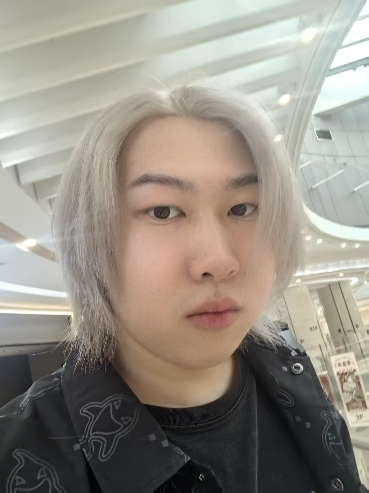

## Youyao Gao

<li><b>Gender:</b> Male</li>
<li><b>Nationality:</b> China</li>
<li><b>Hometown:</b> Shanghai</li>
<li><b>Email:</b> youyaog@andrew.cmu.edu / youyaogao@gmail.com</li>
<li><b>Contact Number:</b> +86 15221996168</li>

### Education

<li><b>University of Nottingham Ningbo China</b> | BSc (Hons) in Computer Science | GPA: 3.83/4.0 | First-class degree | Sept. 2022 – Present</li> </li>
<li><b>National University of Singapore School of Computing</b> | Summer Research Workshop | May 2024 – Jul. 2024</li>
<li><b>Carnegie Mellon University</b> | Master of Information Technology and Strategy | Aug. 2026 – Present</li>

### Research Experience

<li><b>Reinforcement Learning-Based Hybrid Truck-Drone Delivery Optimization</b> | MDPI Drones | Jun. 2025 – Present</li>
<li>Proposed a reinforcement learning-based optimization framework for hybrid truck-drone delivery systems, covering truck-only delivery, depot-based drone delivery, and onboard drone collaboration under operational constraints.</li>
<li>Designed a PPO-based delivery mode selection module for dynamic on-demand delivery scenarios and evaluated the method on Solomon benchmark instances and real-world case studies.</li>

<li><b>Edge-Enhanced Dual-Stream Transformer for Small Polyp Segmentation</b> | May 2025 – Present</li>
<li>Designed and implemented an edge-enhanced dual-stream segmentation framework based on MMSegmentation and Swin Transformer for small polyp segmentation.</li>
<li>Introduced a Laplacian-based edge extraction branch and cross-attention fusion mechanism to enhance boundary-aware feature learning.</li>
<li>Conducted experiments and ablation studies on standard polyp segmentation benchmarks using mDice, mAcc, and aAcc.</li>

### Work Experience

<li><b>Shanghai SenseTime Intelligent Technology</b> | Algorithm Engineer | Oct. 2024 – Oct. 2025</li>
<li>Worked on a smart Q&A system for medical devices based on Retrieval-Augmented Generation, including document parsing, data preprocessing, model evaluation, and system optimization.</li>
<li>Worked on key-point evaluation for embodied intelligent robots by fine-tuning OpenPose, designing action segmentation modules, extracting key-point trajectories, and applying Dynamic Time Warping for quantitative evaluation.</li>

<li><b>Shanghai Big Data</b> | Algorithm Engineer, Big Data Department | Aug. 2024 – Oct. 2024</li>
<li>Participated in a smart legislation project involving corpus collection, SQL-based data preprocessing, BGE-M3 embedding model selection, retrieval optimization, and performance evaluation using Hit Rate and MRR.</li>

### Projects

<li><b>2025 Mathematical Contest in Modeling</b> | Team Leader | Jan. 2025 – May 2025</li>
<li>Designed a HAPF-LSTM prediction model combining Random Forest, MLP regression, and LSTM-Attention for Olympic medal prediction and strategic sports investment analysis.</li>

<li><b>Logic Diagram Generation Software - Logify</b> | Project Leader | Sept. 2024 – May 2025</li>
<li>Designed and deployed an LLM-powered web application that converts natural language logic descriptions into flowcharts, mind maps, and sequence diagrams.</li>
<li>Fine-tuned Qwen2.5-coder-7B using LoRA and integrated Flask, Ollama-based LLMs, and Mermaid CLI for real-time diagram generation.</li>

<li><b>2024 Shuwei Cup International Mathematical Contest in Modeling</b> | Team Leader | Nov. 2024 – Jan. 2025</li>
<li>Applied Co-Kriging, Regression Kriging, cKDTree optimization, Spearman correlation, and 2D-KDE analysis for spatial prediction tasks.</li>

<li><b>National University of Singapore SOC Summer Research Workshop</b> | Team Leader | May 2024 – Jul. 2024</li>
<li>Developed machine learning models including Logistic Regression and Random Forest with SMOTE and ADASYN to predict men's 100m Olympic finalists.</li>

### Honors and Awards

<li><b>Software Copyright Registration Number:</b> 2025SR2334315 | 2025</li>
<li><b>UNNC Academic Year 2024-2025 Learning Community Forum Student Representative Certificate</b> | 2025</li>
<li><b>2025 Mathematical Contest in Modeling:</b> Successful Participant Award | 2025</li>
<li><b>2024 Shuwei Cup International Mathematical Contest in Modeling:</b> Meritorious Award | 2024</li>
<li><b>ABRSM Grade 5 Music Theory Examination:</b> Merit | 2017</li>

### Skills

<li><b>Programming Skills:</b> Python, C/C++, Java, JavaScript, Haskell, SQL, R, Stata</li>
<li><b>Machine Learning and Data Science:</b> PyTorch, scikit-learn, TensorFlow, pandas, LSTM, Random Forest, Retrieval-Augmented Generation, OpenPose, Dynamic Time Warping</li>
<li><b>Techniques and Tools:</b> Anaconda, Flask, Django, Git, Docker, Linux, VMware, VirtualBox, MySQL, MATLAB, GeoGebra, LaTeX, Figma</li>
<li><b>Language Skills:</b> English (TOEFL 104, GRE 339), Mandarin (native)</li>
<li><b>Research Interests:</b> Data Science, Machine Learning, Computer Vision, Medical Image Segmentation, Reinforcement Learning</li>

